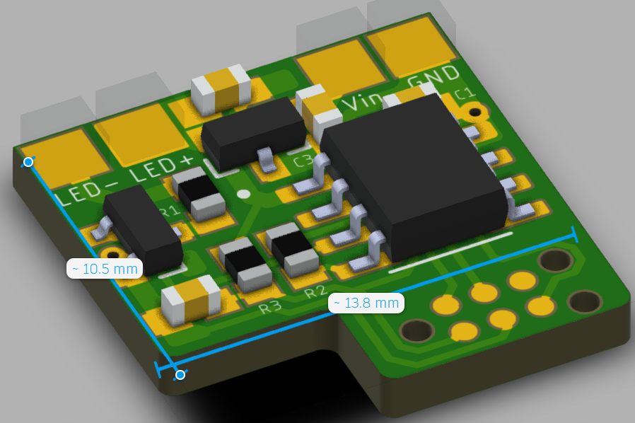
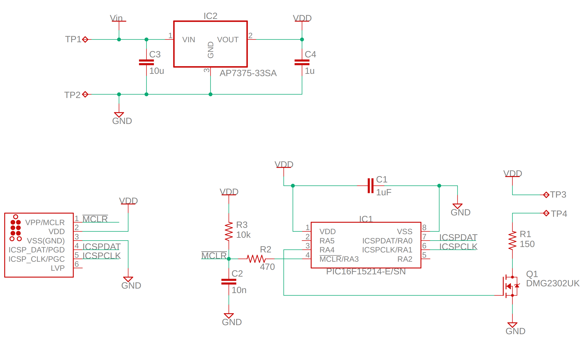
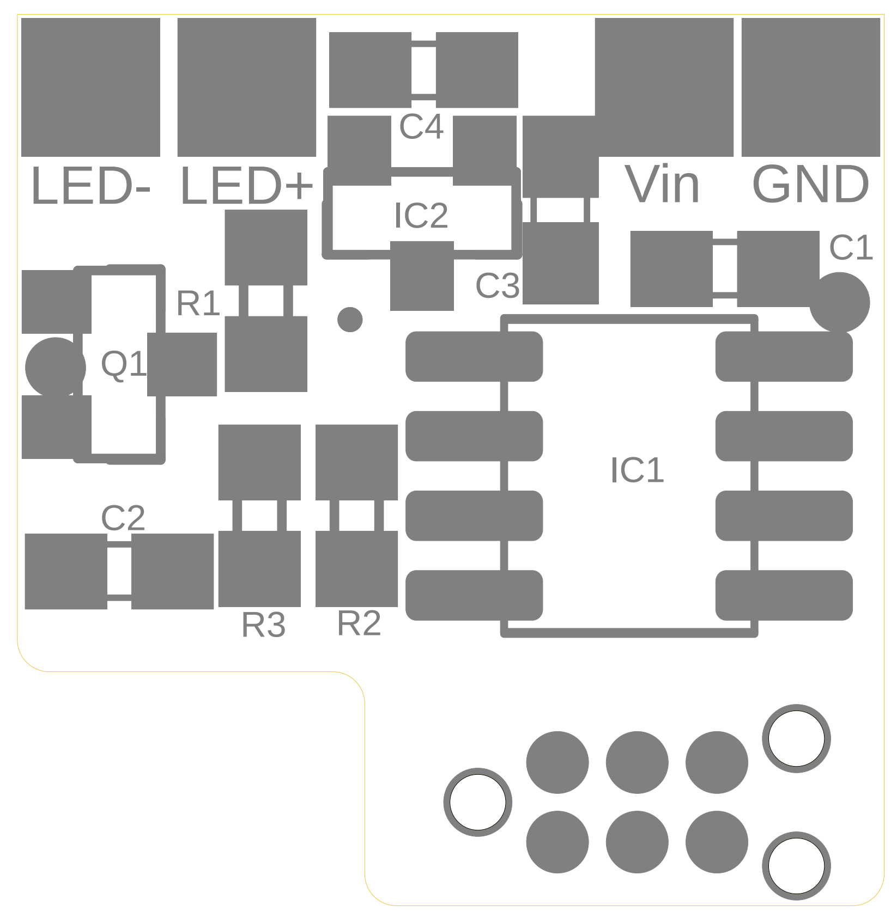
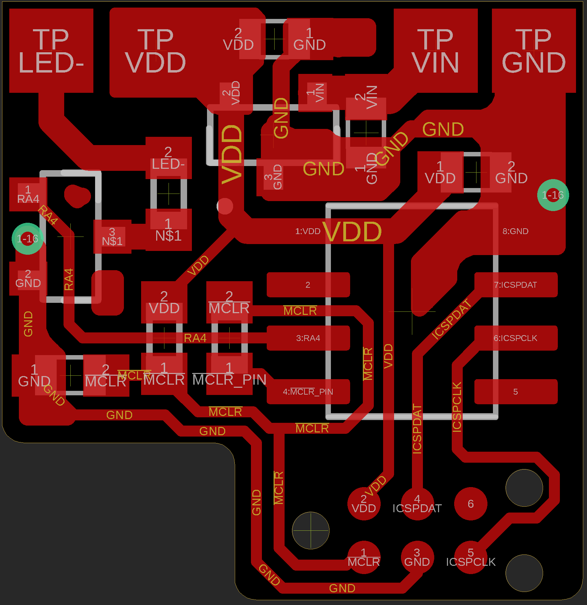

# IR Blinker

## Programming Connection

The programming tab shown at the bottom of the rendering above (which can be cut off after flashing for minimal final board size!) can be connected to a PIC programmer (such as a PICkit or ICD) via a Tag-Connect cable. The Tag-Connect cable should be a 6-pin no-legs variant such as [this one](https://www.tag-connect.com/product/tc2030-pkt-nl-6-pin-no-legs-cable-for-microchip-pickit-3) that connects to a [PICkit 3](https://www.microchip.com/en-us/development-tool/pg164130). A [retention clip](https://www.tag-connect.com/product/tc2030-retaining-clip-board-3-pack) for the no-leg Tag-connect connector makes life very easy. Lastly, if you lose your retention clips, you might want to invest in a [state-of-the-art-and-absolutely-not-just-a-paperclip retention clip holder](https://www.tag-connect.com/product/tc20x0-cliphanger).

